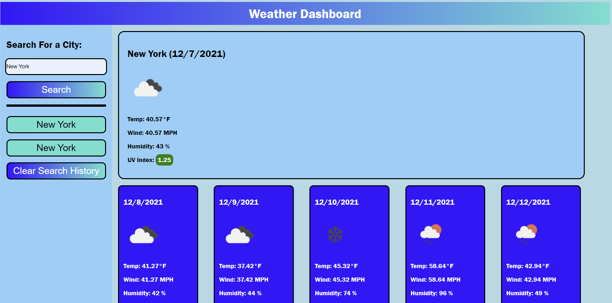

## Weather Dashboard

## Description
The goal for this project was to use A server party API to help create a weather app. This project enabled me to programatically change HTML elements in javascript, use the API documentation to learn how to use it effectively, and allowed me to practice CSS and HTML.

## Built With
* HTML
* CSS
* JavaScript
* Server Side API's - Open Weather App

## Website

Deployed Page: https://mirandal27.github.io/Weather-Dashboard/

## Credits
Miranda Lane